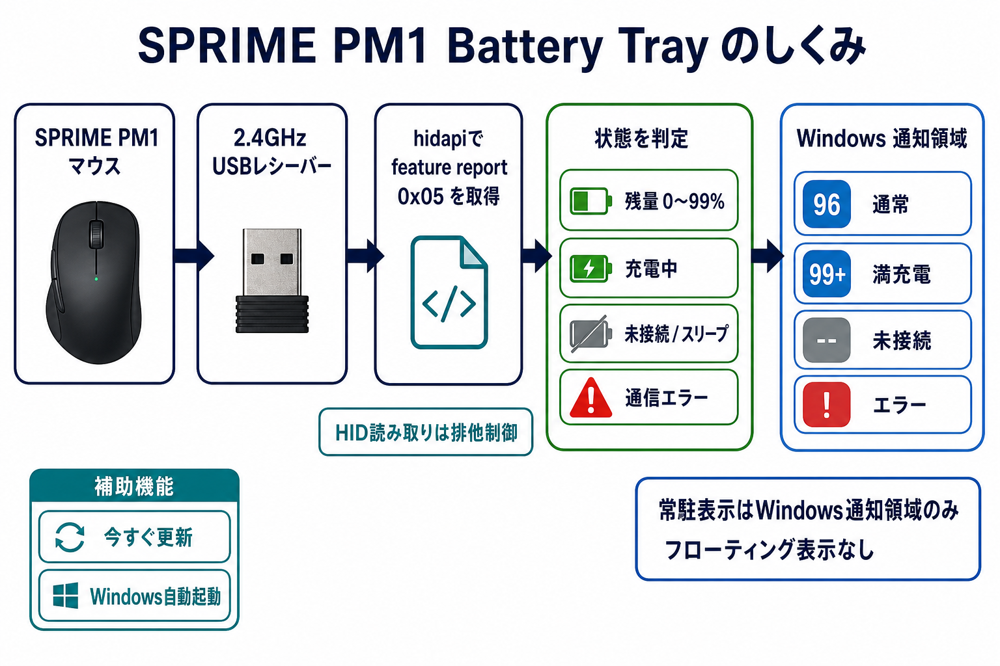
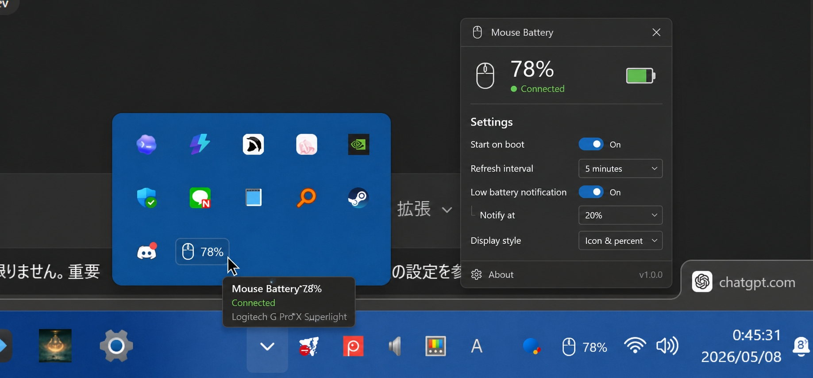

# SPRIME PM1 Battery Tray

Windowsの通知領域にSPRIME PM1ワイヤレスマウスのバッテリー残量を大きな数字で常駐表示するツールです。設定画面を開かなくても、タスクトレイを見るだけで残量・充電中・未接続・通信エラーを確認できます。

> **非公式・非提携について**
> このプロジェクトは独立して開発された非公式ツールであり、SPRIMEまたは関連企業の公式製品、提携製品、承認製品、スポンサー製品ではありません。製品名・サービス名・商標は各権利者に帰属します。

  

上の画像はトレイ表示と設定画面の参考UIです。実際の表示はWindowsのテーマや通知領域の配置によって異なります。

## ダウンロード

通常利用者は[GitHub Releases](https://github.com/misaka310/sprime-pm1-battery-tray/releases/latest)から`SPRIME-PM1-Battery-Tray-*.zip`をダウンロードして展開し、`SPRIME-PM1-Battery-Tray.exe`を実行してください。

Pythonや開発環境を用意する必要はありません。

## 表示

| 表示 | 状態 |
|---|---|
| `96` | 接続中・残量96% |
| `99+` | 100%または満充電に近い状態 |
| `--` | 未接続またはスリープ中 |
| `!` | HID通信エラー |

通常は黒〜濃いグレー、充電中は緑、低残量時は赤い背景で表示します。

## 主な機能

- 32×32ピクセルのトレイアイコンへ残量を大きな数字で表示
- 定期更新と手動更新が重なってもHID読み取りを直列化
- 設定画面から手動更新、ログ表示、自動起動を操作
- Windowsログイン時の自動起動をユーザー権限だけで設定
- UI処理とHID通信を分離し、バックグラウンドで低負荷動作

## 対応環境

- Windows 10 / 11（64bit）
- SPRIME PM1 Wireless Mouse
- 2.4GHz USBレシーバー接続

実機確認済みのHID識別子はVID `0x1915`、PID `0xAC1C`、feature report `0x05`です。

## 互換性の注意

- 同じPM1系でも、別ファームウェア・別レシーバー・別ロットでは動作しない可能性があります
- PM1以外のSPRIME製品は未確認です
- マウスがスリープ中、切断中、またはOS側でHIDデバイスを開けない場合は`--`や`!`になります

他環境で読めない場合は、開発資料の`scripts\probe.ps1`と`scripts\e2e.ps1`でHID検出結果を確認してください。

## 使い方

1. Releasesから取得したZIPを展開します。
2. `SPRIME-PM1-Battery-Tray.exe`を起動します。
3. Windowsの通知領域へ数字アイコンが表示されることを確認します。
4. 設定を変更する場合は、トレイアイコンを右クリックして`Show settings`を選びます。

設定画面では`Refresh Now`による手動更新、`Open Logs`によるログ確認、自動起動の切り替えができます。

## トラブルシューティング

- **`--`になる**: マウスを動かしてスリープ解除し、`Refresh Now`を試してください
- **`!`になる**: PM1の接続と、別アプリがHIDデバイスを使用していないか確認してください
- **アイコンが見えない**: Windowsの通知領域で本アプリを常に表示するよう設定してください
- **設定をリセットしたい**: `scripts\reset_config.ps1`を実行します

## 開発・検証

ソースからの実行、テスト、EXEビルド、実機E2E、公開前確認は[開発・検証ガイド](docs/development.md)を参照してください。

UI仕様は[docs/ui-spec.md](docs/ui-spec.md)、Windows GUI検証は[docs/windows-gui-testing.md](docs/windows-gui-testing.md)にあります。

## ライセンス

このリポジトリのコードは[MIT License](LICENSE)で公開しています。
